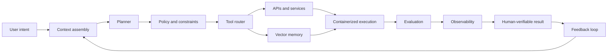

  

# Koushik Reddy Vayalpati

I build toward **production-grade agentic AI systems**: software that can reason over context, select tools, call APIs, coordinate multi-step workflows, and return outputs people can verify.

My work sits between AI engineering, backend systems, infrastructure, full-stack product work, and enterprise workflows. I am focused on the engineering behind real agents: routing, tools, state, evaluation, safety boundaries, fallback paths, scaling, and reliable execution.

## Technical Achievements

I am shaping my work around systems that are deeper than a prompt wrapper. The goal is to build agents that behave like software systems: observable, constrained, testable, and useful inside real workflows.

| Area | What I bring |
| --- | --- |
| Agent orchestration | Building with planners, routers, tool calls, execution state, caches, evaluation, and feedback loops instead of single-shot completions. |
| Production discipline | Designing around service boundaries, API contracts, validation, failure modes, tests, and human-reviewable outputs. |
| Backend ownership | Building the parts that make AI systems usable: endpoints, data flow, auth-aware logic, integration paths, and error handling. |
| Scaling and infrastructure | Thinking in containers, Linux environments, orchestration, service health, logs, metrics, and deployment paths. |
| Enterprise workflow thinking | Mapping software to business processes, user roles, approvals, handoffs, CRM/SAP-style operations, and operational constraints. |
| Debugging depth | Tracing issues across UI behavior, backend logic, data shape, API responses, and integration assumptions. |
| AI system judgment | Grounding model behavior with context, constrained tools, SQL safety, retrieval/memory patterns, checks, and evaluation loops. |

## System Shape

## Engineering Focus

| Layer | Signal |
| --- | --- |
| Agent routing | Tool selection, model routing, confidence-based escalation, multi-step execution, state transitions, and controlled outputs. |
| Backend systems | APIs, service logic, auth-aware flows, database interaction, and deployment-ready structure. |
| Infrastructure | Linux/OS fundamentals, Docker containers, Kubernetes orchestration, service health, and Grafana-style observability. |
| Retrieval and memory | Vector database patterns for semantic search, long-term context, retrieval-augmented workflows, and agent memory. |
| Enterprise workflows | SAP/CRM-oriented applications that connect software decisions with business operations. |
| Product engineering | Frontend-to-backend features with real user paths, state, validation, and edge cases. |
| AI applications | ML and AI workflow projects, including image captioning and model-driven pipelines. |
| Systems fundamentals | Algorithms, debugging habits, data structures, and implementation depth through focused practice. |

## Agent-Oriented Work

| Project | What it proves |
| --- | --- |
| [tokenpilot-router](https://github.com/koushikreddyvayalpati/tokenpilot-router) | LangGraph router that classifies prompts, tries deterministic/local answers first, escalates across model tiers using confidence checks, caches answers, supports Fireworks cache affinity, runs eval datasets, includes pytest coverage, and ships with a Dockerfile. |
| [langgraph-sql-analyst](https://github.com/koushikreddyvayalpati/langgraph-sql-analyst) | Read-only SQL analyst agent with LangGraph state, LangChain/Anthropic tool calling, schema inspection tools, SQL validation, risky-query approval interrupts, SQL safety tests, debug streaming, and LangSmith tracing support. |

## Selected Product Work

| Project | Production-relevant signal |
| --- | --- |
| [TruStudSelBackend](https://github.com/koushikreddyvayalpati/TruStudSelBackend) | Backend service layer connected to product workflows: APIs, data models, auth paths, and error handling. |
| [TruStudSel](https://github.com/koushikreddyvayalpati/TruStudSel) | Full product surface: user flow, frontend behavior, backend integration, and product ownership. |
| [Sapsolutionswebsite](https://github.com/koushikreddyvayalpati/Sapsolutionswebsite) | Enterprise/SAP positioning with business-system communication and workflow framing. |
| [LinqCRMKoushik](https://github.com/koushikreddyvayalpati/LinqCRMKoushik) | CRM-oriented workflow thinking: records, users, business process, and operational data flow. |
| [Image Captioning using VGG, InceptionV3, ResNet, EfficientNet](https://github.com/koushikreddyvayalpati/Image-captioning-using-VGG-INCEPTIONV3-RESNET-EFFICENT-BO) | ML pipeline experimentation, model comparison, and computer vision fundamentals. |
| [DSA_NEETCODE_BLIND_75](https://github.com/koushikreddyvayalpati/DSA_NEETCODE_BLIND_75) | Problem-solving practice and implementation discipline. |

## Working Stack

**Languages:** `Python` `JavaScript` `TypeScript` `Java` `SQL`  
**Backend:** `Node.js` `Express` `Django` `REST APIs` `Auth Flows` `Service Logic`  
**Frontend:** `React` `Next.js` `HTML` `CSS` `Tailwind CSS`  
**AI Systems:** `LangGraph` `LangChain` `Tool Calling` `Agent Orchestration` `Model Routing` `RAG` `Vector Databases` `Memory` `Evaluation`  
**Infrastructure:** `Linux` `Docker` `Kubernetes` `Containers` `Grafana` `LangSmith` `Logs` `Metrics`  
**Enterprise:** `SAP Concepts` `CRM Workflows` `Business Process Automation`

## Current Thesis

The best agents will look less like demos and more like distributed systems with reasoning inside them. I am interested in that layer:

- planners that decompose work,
- routers that choose models and tools,
- memory and state that preserve useful context without polluting execution,
- APIs that expose real actions,
- containers and orchestration that let services scale,
- observability that shows what the system is doing,
- evaluators that check outputs before handoff,
- approval gates for risky actions.

That is the standard I am building toward: useful AI wrapped in strong software engineering.

## Contact

[GitHub](https://github.com/koushikreddyvayalpati) · [Email](mailto:koushikreddyvayalpati@gmail.com) · [LinkedIn: add URL] · [Portfolio: add URL] · [Resume: add URL]
