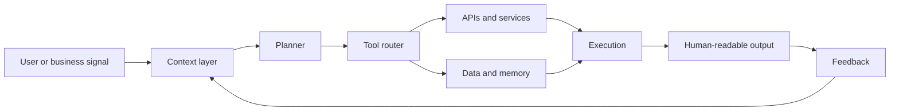

  

# Koushik Reddy Vayalpati

I build toward **agentic AI systems**: software that can read context, choose tools, coordinate workflows, and hand useful work back to people.

My direction sits between AI engineering, full-stack product work, backend systems, and enterprise workflows. I am especially interested in roles like **Forward Deployed AI Engineer**, **Agentic AI Engineer**, **Full Stack Engineer**, and **Enterprise AI Engineer**.

## System Shape

## What I Am Building Toward

| Layer | Current signal |
| --- | --- |
| Agent routing | Exploring model/tool routing and orchestration through [tokenpilot-router](https://github.com/koushikreddyvayalpati/tokenpilot-router). |
| Enterprise workflows | Building SAP/CRM-oriented projects that connect software with business operations. |
| Product systems | Working across frontend, backend, authentication, data handling, and user workflows. |
| AI applications | Studying and building ML-focused work, including image captioning and model-driven pipelines. |
| Engineering fundamentals | Practicing implementation depth through algorithms, debugging, and backend/API design. |

## Selected Work

| Project | Signal |
| --- | --- |
| [tokenpilot-router](https://github.com/koushikreddyvayalpati/tokenpilot-router) | Agentic routing / AI workflow direction. Add architecture details once finalized. |
| [Sapsolutionswebsite](https://github.com/koushikreddyvayalpati/Sapsolutionswebsite) | SAP-focused web work and enterprise positioning. |
| [TruStudSel](https://github.com/koushikreddyvayalpati/TruStudSel) | Product application work. Add the user problem and strongest technical feature. |
| [TruStudSelBackend](https://github.com/koushikreddyvayalpati/TruStudSelBackend) | Backend service layer connected to a product workflow. |
| [Image Captioning using VGG, InceptionV3, ResNet, EfficientNet](https://github.com/koushikreddyvayalpati/Image-captioning-using-VGG-INCEPTIONV3-RESNET-EFFICENT-BO) | Computer vision and ML experimentation. |
| [LinqCRMKoushik](https://github.com/koushikreddyvayalpati/LinqCRMKoushik) | CRM-oriented application work. |
| [DSA_NEETCODE_BLIND_75](https://github.com/koushikreddyvayalpati/DSA_NEETCODE_BLIND_75) | Algorithm and problem-solving practice. |

## Working Stack

`Python` `JavaScript` `TypeScript` `Java` `SQL`  
`React` `Next.js` `Node.js` `Express` `Django` `REST APIs`  
`Machine Learning` `Computer Vision` `AI Workflows` `SAP Concepts` `CRM Workflows`

## Current Thesis

The next useful software layer is not just chat. It is systems that can:

- understand a business process,
- select the right model or tool,
- call APIs safely,
- remember context where it matters,
- produce outputs a human can verify and use.

That is the direction I am building toward.

## Contact

[GitHub](https://github.com/koushikreddyvayalpati) · [Email](mailto:koushikreddyvayalpati@gmail.com) · [LinkedIn: add URL] · [Portfolio: add URL] · [Resume: add URL]
