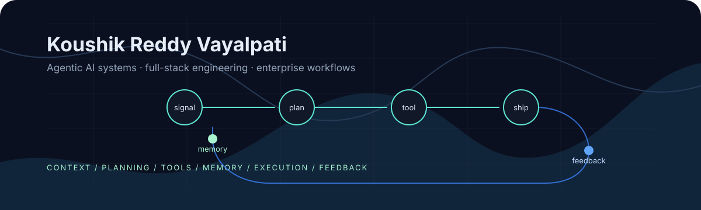
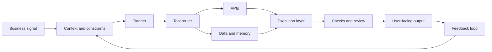

  

# Koushik Reddy Vayalpati

I build toward **production-grade agentic AI systems**: software that can read context, choose tools, call APIs, coordinate workflows, and return work that people can verify.

My work sits between AI engineering, backend systems, full-stack product work, and enterprise workflows. I am especially interested in roles like **Forward Deployed AI Engineer**, **Agentic AI Engineer**, **Full Stack Engineer**, and **Enterprise AI Engineer**.

## Production Signal

Hiring managers usually look for one thing first: can this person ship systems that survive real users, unclear requirements, integrations, bugs, and business constraints?

That is the engineering direction I am building around.

| Production concern | How I think about it |
| --- | --- |
| Reliability | Design workflows with clear inputs, fallbacks, validation points, and human-reviewable outputs. |
| Backend ownership | Treat APIs, service boundaries, data flow, auth, and failure states as first-class product decisions. |
| Debugging | Work from symptoms to root cause across frontend, backend, data, and integration layers. |
| Enterprise fit | Build with business process, user roles, auditability, and system handoff in mind. |
| AI safety in workflows | Keep model output grounded with context, tool constraints, checks, and user verification. |

## System Shape

## Engineering Focus

| Layer | Signal |
| --- | --- |
| Agent routing | Model/tool orchestration, routing logic, workflow execution, and controlled outputs. |
| Backend systems | APIs, service logic, auth-aware flows, database interaction, and deployment-ready structure. |
| Enterprise workflows | SAP/CRM-oriented applications that connect software decisions with business operations. |
| Product engineering | Frontend-to-backend features with real user paths, state, validation, and edge cases. |
| AI applications | ML and AI workflow projects, including image captioning and model-driven pipelines. |
| Fundamentals | Algorithms, debugging habits, and implementation depth through focused practice. |

## Selected Work

| Project | Production-relevant signal |
| --- | --- |
| [tokenpilot-router](https://github.com/koushikreddyvayalpati/tokenpilot-router) | Agentic routing direction: model/tool selection, request flow, and orchestration thinking. |
| [TruStudSelBackend](https://github.com/koushikreddyvayalpati/TruStudSelBackend) | Backend service layer connected to product workflows. Useful place to show APIs, data models, auth, and error handling. |
| [TruStudSel](https://github.com/koushikreddyvayalpati/TruStudSel) | Full product surface: user flow, frontend behavior, backend integration, and product ownership. |
| [Sapsolutionswebsite](https://github.com/koushikreddyvayalpati/Sapsolutionswebsite) | Enterprise/SAP positioning and business-system communication. |
| [LinqCRMKoushik](https://github.com/koushikreddyvayalpati/LinqCRMKoushik) | CRM-oriented workflow thinking and business process modeling. |
| [Image Captioning using VGG, InceptionV3, ResNet, EfficientNet](https://github.com/koushikreddyvayalpati/Image-captioning-using-VGG-INCEPTIONV3-RESNET-EFFICENT-BO) | ML pipeline experimentation and computer vision fundamentals. |
| [DSA_NEETCODE_BLIND_75](https://github.com/koushikreddyvayalpati/DSA_NEETCODE_BLIND_75) | Problem-solving practice and implementation discipline. |

## Working Stack

`Python` `JavaScript` `TypeScript` `Java` `SQL`  
`React` `Next.js` `Node.js` `Express` `Django` `REST APIs`  
`Machine Learning` `Computer Vision` `AI Workflows` `SAP Concepts` `CRM Workflows`

## Current Thesis

The next useful software layer is not only chat. It is software that combines AI reasoning with normal production engineering:

- clear service boundaries,
- reliable API calls,
- constrained tool use,
- context and memory where they are useful,
- observability and debugging paths,
- human verification for important outputs.

That is the kind of system I want to build: useful AI wrapped in software discipline.

## Contact

[GitHub](https://github.com/koushikreddyvayalpati) · [Email](mailto:koushikreddyvayalpati@gmail.com) · [LinkedIn: add URL] · [Portfolio: add URL] · [Resume: add URL]
